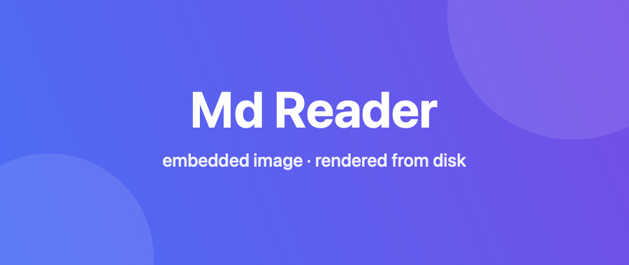

# MdReader

A clean, native **Markdown reader for macOS**, built with SwiftUI. It renders
GitHub‑flavored Markdown — including **tables**, **Mermaid diagrams**, and
**embedded images** — in a `WKWebView`, with native **Print** (and **Save as
PDF** via the standard print dialog) from the **File** menu.



## Download

Grab the latest **notarized, universal** (Apple Silicon + Intel) build from the
[**Releases**](https://github.com/JohnSColeman/md-reader/releases/latest) page.
Download the `.zip`, unzip it, and move **MdReader.app** to `/Applications`.
Because it's signed with a Developer ID and notarized by Apple, it opens without
Gatekeeper warnings.

## Features

- **Tables** — full GFM table support with alignment and zebra striping.
- **Mermaid diagrams** — ` ```mermaid ` fences render to SVG (flowchart,
  sequence, gantt, class, state, …), fully offline.
- **Embedded images** — local images (relative or absolute paths) load from
  disk via a custom URL‑scheme handler; remote and `data:` images work too.
- **Syntax highlighting** — code blocks are highlighted with highlight.js.
- **Print / Save as PDF** — `File ▸ Print…` (⌘P) opens the standard print dialog;
  its **PDF ▸ Save as PDF** button exports a paginated PDF. The document
  re‑renders in a light theme first, for legible output on paper.
- **Open / Close** — document‑based app: `File ▸ Open…` (⌘O), **Open Recent**,
  and `File ▸ Close` (⌘W).
- **Contents sidebar** — a left‑margin outline of the document's headings (H1–H3),
  indented by level. Click an entry to scroll that heading to the top of the view;
  the current section highlights automatically as you scroll. Toggle it from the
  window toolbar. New windows open at a wide default size (1200×740).
- **Find in page** — ⌘F pops up a find field in the top‑right. Type and press
  Return to jump to the next match (⇧⌘G / the ▲ button for previous); the match
  scrolls near the top and is highlighted, with an "n of m" count. Highlighting
  uses the CSS Custom Highlight API, so the document is never modified. Esc closes.
- **Live reload** — edit the open file in any editor and the view re‑renders on
  save (scroll position preserved), including editors that save atomically.
- **Text zoom** — ⌘=, ⌘−, ⌘0 scale the text (reflowing); the level is remembered.
- **Copy code** — hover a code block for a Copy button (writes to the pasteboard).
- **Math** — inline `$…$` and display `$$…$$` LaTeX render with KaTeX, bundled
  for offline use; prose like "$5 and $10" is left untouched.
- **Front matter** — a leading `---` YAML block renders as a tidy title/metadata
  header (title, author, date, tags as pills) instead of a stray rule.
- **Callouts** — GitHub-style `> [!NOTE] / [!TIP] / [!IMPORTANT] / [!WARNING] /
  [!CAUTION]` render as coloured, icon-labelled boxes.
- **Footnotes** — `[^id]` references and definitions render with jump/back links.
- **Emoji** — `:shortcode:` (e.g. `:rocket:`) becomes the emoji, from a bundled
  offline map; shortcodes inside code are left alone.
- **Page formats (WYSIWYG width)** — the reading width equals the selected page's
  *printable* width (A4 / US Letter × Portrait / Landscape), so the view matches
  print and PDF exactly. Defaults to your region's paper. It **auto‑switches to
  Landscape** when a document has content wider than Portrait can print, and only
  scrolls a block if it's wider than Landscape too (nothing is shrunk). Prose keeps
  a readable measure; tables/code/diagrams use the full page width. Choose or pin a
  format from the **Format** menu.
- **Light & dark** — follows the system appearance automatically.
- **External links** open in your default browser rather than navigating away.

## Requirements checklist

| Requirement                              | Status |
| ---------------------------------------- | :----: |
| Render tables                            |   ✅   |
| Render Mermaid diagram scripts           |   ✅   |
| Render embedded image links              |   ✅   |
| Print / Export to PDF via menu + dialog  |   ✅   |
| Open / Close File‑menu items             |   ✅   |
| Professional look and appearance         |   ✅   |

## Building & running

1. Open **`MdReader.xcodeproj`** in Xcode 16 or later.
2. Select the **MdReader** scheme and press **⌘R**.

Or from the command line:

```bash
xcodebuild -project MdReader.xcodeproj -scheme MdReader -configuration Debug build
```

The project is configured for **ad‑hoc signing** ("Sign to Run Locally"), so it
builds and runs without an Apple Developer account. To distribute it, set your
team under *Signing & Capabilities* and enable the App Sandbox if desired (see
note below).

Try it with the included sample: **`Samples/Welcome.md`** — open it from within
the app, or right‑click the file ▸ *Open With* ▸ MdReader.

## Releasing

Distribution builds are produced by the **Release** GitHub Actions workflow
([`.github/workflows/release.yml`](.github/workflows/release.yml)). Pushing a
version tag builds a universal Release binary, signs it with Developer ID and a
hardened runtime, notarizes and staples it, and publishes a GitHub Release with
the zipped app attached:

```bash
git tag v0.1.0
git push origin v0.1.0
```

The workflow relies on four repository secrets (`DEVELOPER_ID_P12_BASE64`,
`P12_PASSWORD`, `NOTARY_APPLE_ID`, `NOTARY_PASSWORD`); see the header comment in
the workflow file for details. It can also be run manually from the **Actions**
tab, which uploads the app as a workflow artifact instead of publishing a release.

## How it works

- **`MdReaderApp`** — a SwiftUI `DocumentGroup(viewing:)` app; document open,
  close, and Open Recent come for free.
- **`MarkdownDocument`** — a read‑only `FileDocument` that loads the file text.
- **`MarkdownWebView`** — wraps `WKWebView`, loads the bundled `Web/index.html`
  renderer, and feeds it the Markdown (base64‑encoded to avoid escaping). It
  also owns printing via `NSPrintOperation` and the standard print dialog, whose
  *Save as PDF* covers PDF export.
  - A custom **`mdimg://`** `WKURLSchemeHandler` serves local image files from
    disk, so relative image links resolve relative to the document.
- **`Web/`** — the offline rendering stack: [marked](https://github.com/markedjs/marked)
  (Markdown → HTML), [mermaid](https://github.com/mermaid-js/mermaid) (diagrams),
  and [highlight.js](https://github.com/highlightjs/highlight.js) (code), plus a
  GitHub‑style stylesheet with light/dark and print themes.
- Menu commands reach the focused window's web view through a
  `@FocusedValue` (`WebCommander`).

## Notes on sandboxing

The app is **not sandboxed** by default so that relative image links can be read
from the document's folder. If you sandbox it for App Store distribution, add
`com.apple.security.files.user-selected.read-only` and resolve sibling images
via a security‑scoped bookmark of the document's parent folder.

## License

MdReader is licensed under the **Apache License 2.0** — see [`LICENSE`](LICENSE).

### Third‑party licenses

- marked — MIT
- mermaid — MIT
- highlight.js — BSD‑3‑Clause
- KaTeX — MIT

Bundled builds live in `MdReader/Web/`.
