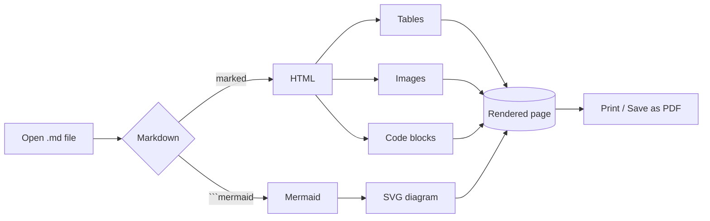
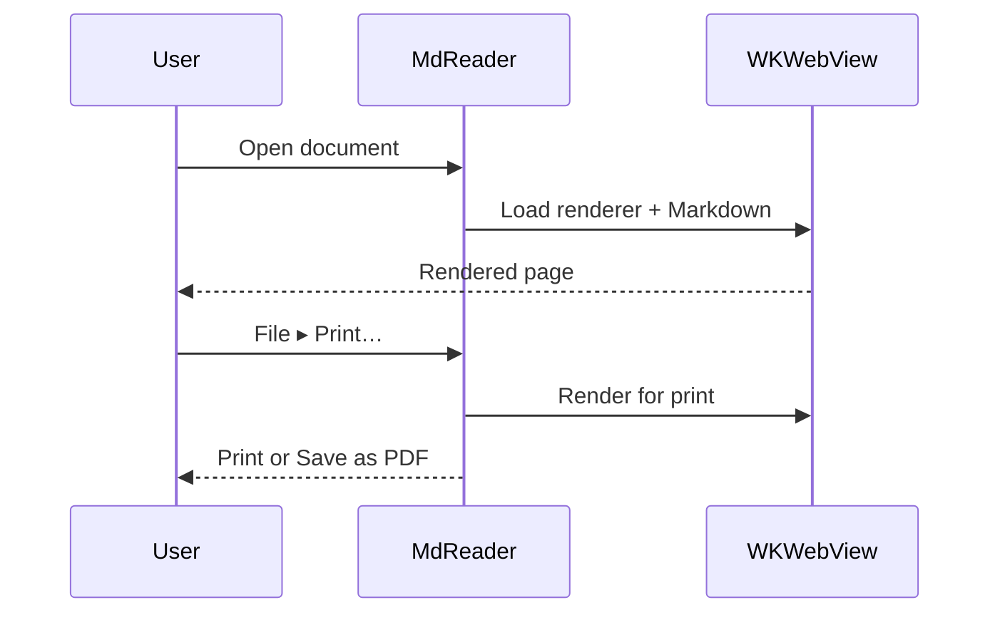

# MdReader

A clean, native **Markdown reader** for macOS. This sample exercises the three
things the app must render: **tables**, **Mermaid diagrams**, and **embedded
image links** — plus the usual Markdown niceties.


---

## Tables

| Feature            | Supported | Notes                                   |
| ------------------ | :-------: | --------------------------------------- |
| GFM tables         |     ✅    | Alignment, zebra striping               |
| Mermaid diagrams   |     ✅    | Flowcharts, sequence, gantt, and more   |
| Embedded images    |     ✅    | Local (relative/absolute) and remote    |
| Syntax highlight   |     ✅    | Powered by highlight.js                 |
| Print / PDF export |     ✅    | Native dialog from the **File** menu    |

Right-aligned numbers work too:

| Item        |    Qty |   Price |
| ----------- | -----: | ------: |
| Coffee      |      2 |  £5.00  |
| Croissant   |      1 |  £2.40  |
| **Total**   |  **3** | **£7.40** |

## Mermaid diagrams

A flowchart:



A sequence diagram:



## Code with syntax highlighting

```swift
struct MarkdownDocument: FileDocument {
    var text: String
    init(configuration: ReadConfiguration) throws {
        guard let data = configuration.file.regularFileContents else {
            throw CocoaError(.fileReadCorruptFile)
        }
        self.text = String(decoding: data, as: UTF8.self)
    }
}
```

```javascript
const html = marked.parse(md);
document.getElementById("content").innerHTML = html;
```

## Math

Inline math such as $E = mc^2$ and the quadratic roots
$x = \dfrac{-b \pm \sqrt{b^2 - 4ac}}{2a}$ render with KaTeX.

A display equation:

$$
\int_{-\infty}^{\infty} e^{-x^2}\,dx = \sqrt{\pi}
$$

## Callouts

> [!NOTE]
> MdReader recognises GitHub-style alerts.

> [!TIP]
> Use the **Format** menu to switch between A4 and US Letter, portrait or landscape.

> [!WARNING]
> Content wider than the page switches to landscape automatically.

> [!IMPORTANT]
> Live reload watches the file on disk, so edits appear as you save. :rocket:

> [!CAUTION]
> Viewing never modifies your file.

## Footnotes & emoji

Markdown gets a proper footnote[^1] with a back-link, and emoji shortcodes such as
:sparkles:, :book:, and :coffee: render inline.

[^1]: This is the footnote definition — use the arrow to jump back up. :arrow_up:

## Text, lists & quotes

Inline styles: **bold**, *italic*, ~~strikethrough~~, `inline code`, and a
[link to the project context](https://read-md.app/).

- [x] Render tables
- [x] Render Mermaid
- [x] Render embedded images
- [ ] Your next document

> **Tip:** Press ⌘P to print — the dialog's **PDF ▸ Save as PDF** button also
> exports a PDF. Open another file with ⌘O, and close the window with ⌘W.

1. First
2. Second
3. Third

Press <kbd>⌘</kbd><kbd>P</kbd> to print.
